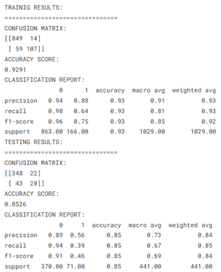

# Public-Dataset
BPP Module: Data Science Professional Practice- Public dataset
# Introduction
This project aims to address a critical challenge faced by organisations globally—employee attrition. Logistic regression was applied to build a predictive model capable of identifying which employees are at risk of leaving a company. 

# Data
The data is sourced from Kaggle: https://www.kaggle.com/datasets/rohitsahoo/employee

# Methodology
Logistic regression is a widely used statistical model suitable for binary classification tasks — where the outcome is one of two categories, such as "stay" or "quit". It models the probability of a specific outcome (employee leaving) based on a set of independent variables (e.g., age, salary, job satisfaction, tenure).

# Results
From the training results, the model performed well overall with a high accuracy of 93% and a precision of 94% for employees who stayed and 88% for those who left. The recall for employees who left was 64%, which means the model missed some actual cases of attrition but still detected many.
On the test set, the accuracy dropped slightly to 85%. The model maintained strong performance in predicting those who stayed (recall = 94%) but was weaker in identifying employees who left (recall = 39% and precision = 56%). This suggests the model is better at predicting retention than attrition, as classes are imbalanced. 

# Conclusion
Key factors such as salary, work-life balance, and job satisfaction were identified as key factors through data cleaning, exploratory analysis, and visualisation. The model achieved good overall accuracy, offering valuable insights for HR to proactively address retention. 
However, further improvements could include testing additional modelling techniques (e.g., random forests, gradient boosting) and addressing class imbalance and incorporating more granular or real-time data. Ensuring ongoing monitoring and updating of the model will also enhance its practical utility. 

# References
-	Sahoo, R. (2022) Employee Attrition Prediction Dataset. Available at: https://www.kaggle.com/datasets/rohitsahoo/employee 
